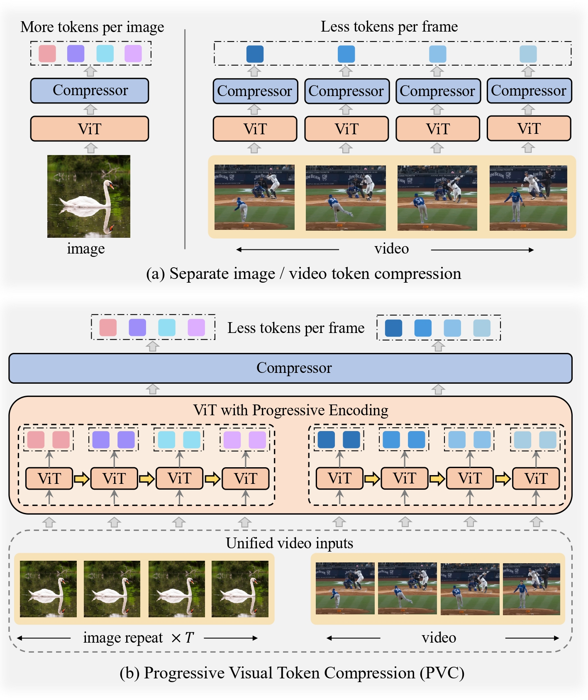

# Progressive Visual Token Compression (PVC)

[](https://arxiv.org/abs/2412.09613)
[](https://huggingface.co/OpenGVLab/PVC-InternVL2-8B)

The official implementation of the paper "[PVC: Progressive Visual Token Compression for Unified Image and Video Processing in Large Vision-Language Models](https://arxiv.org/abs/2412.09613)".

We introduce the **Progressive Visual Token Compression (PVC)** in large vision-language models (VLMs), which unifies the visual inputs as videos and progressively compresses vision tokens across video frames. Our PVC achieves:

* Preserve spatial details and temporal dynamics for both images and videos.
* Effectively reduce the tokens used for each video frame and image tile.
* SoTA performance on various video benchmarks, including long and fine-grained short video tasks.
* No performance loss on image benchmarks, especially on detail-sensitive tasks.

<div style="text-align: center;">
    
</div>

## 📈 Results

Our implementation is based on the [InternVL2](https://github.com/OpenGVLab/InternVL) model, referred to as **PVC<sub>InternVL2</sub>**

### Video Understanding Benckmarks

| Model | LLaVA-OneVision-7B | Qwen2-VL-7B | InternVL2-8B | PVC<sub>InternVL2</sub>-8B <br> 🤗 [link](https://huggingface.co/OpenGVLab/PVC-InternVL2-8B) |
| :--------------: | :--: | :--: | :--: | :--: |
| \# token/frame   | 196  | -    | 256  | 64   |
|                  |      |      |      |      |
| MVbench          | 56.7 | 67.0 | 66.4 | 73.8 |
| VideoMME w/o-sub | 58.2 | 63.3 | 54.0 | 64.1 |
| VideoMME w-sub   | 61.5 | 69.0 | 56.9 | 69.7 |
| MLVU             | 64.7 | -    | 52.0 | 72.4 |
| LongVideoBench   | 56.5 | -    | -    | 59.2 |
| NextQA           | 79.4 | -    | -    | 82.0 |
| Egoschema        | 60.1 | 66.7 | 55.0 | 59.6 |
| PercepTest       | 57.1 | 62.3 | 52.0 | 68.4 |
| AcNet-QA         | 56.6 | -    | -    | 57.1 |

### Image Understanding Benckmarks

| Model | LLaVA-OneVision-7B | Qwen2-VL-7B | InternVL2-8B | PVC<sub>InternVL2</sub>-8B <br> 🤗 [link](https://huggingface.co/OpenGVLab/PVC-InternVL2-8B) |
| :--------------------: | :--: | :--: | :--: | :--: |
| \# token/image tile    | 729  | -    | 256  | 64   |
|                        |      |      |      |      |
| AI2D<sub>test</sub>    | 81.4 | 83.0 | 83.8 | 83.8 |
| ChartQA<sub>test</sub> | 80.0 | 83.0 | 83.3 | 84.1 |
| DocVQA<sub>test</sub>  | 87.5 | 94.5 | 91.6 | 92.5 |
| InfoVQA<sub>test</sub> | 68.8 | 76.5 | 74.8 | 75.0 |
| SQA<sub>test</sub>     | 96.0 | -    | 97.1 | 97.7 |
| TextVQA<sub>val</sub>  | -    | 84.3 | 77.4 | 80.0 |
| MMB<sub>en-test</sub>  | -    | 83.0 | 81.7 | 83.9 |
| MME<sub>sum</sub>      | 1998 | 2327 | 2210 | 2282 |
| MMMU<sub>val</sub>     | 48.8 | 54.1 | 49.3 | 50.9 |
| SEED<sub>I</sub>       | 75.4 | -    | 76.2 | 77.2 |
| OCRBench               | -    | 866  | 794  | 807  |

## 🛠️ Usage

You can use `pip install -r requirements.txt` to set up the environment. Please use `transformers>=4.37.2` to ensure the model works normally.

```python
import torch
from transformers import AutoTokenizer, AutoModel
from utils.preprocess import load_image, load_video

path = 'OpenGVLab/PVC-InternVL2-8B'
model = AutoModel.from_pretrained(
    path,
    torch_dtype=torch.bfloat16,
    low_cpu_mem_usage=True,
    trust_remote_code=True).eval().cuda()
tokenizer = AutoTokenizer.from_pretrained(path, trust_remote_code=True, use_fast=False)
generation_config = dict(max_new_tokens=1024, do_sample=True)

# single-image conversation
pixel_values = load_image('./assets/example_image1.jpg', max_num=12).to(torch.bfloat16).cuda()
data_flag = torch.tensor([1], dtype=torch.long).cuda()

question = '<image>\nWhat is in the image?'
response = model.chat(tokenizer, pixel_values, question, generation_config, data_flag=data_flag)
print(f'User: {question}\nAssistant: {response}')

# multi-image conversation
pixel_values1 = load_image('./assets/example_image1.jpg', max_num=12).to(torch.bfloat16).cuda()
pixel_values2 = load_image('./assets/example_image2.jpg', max_num=12).to(torch.bfloat16).cuda()
pixel_values = torch.cat((pixel_values1, pixel_values2), dim=0)
data_flag = torch.tensor([2], dtype=torch.long).cuda()
num_patches_list = [pixel_values1.shape[0], pixel_values2.shape[0]]

question = 'Image-1: <image>\nImage-2: <image>\nWhat are the similarities and differences between these two images.'
response = model.chat(tokenizer, pixel_values, question, generation_config, data_flag=data_flag, num_patches_list=num_patches_list)
print(f'User: {question}\nAssistant: {response}')

# video conversation
pixel_values, num_patches_list = load_video('./assets/example_video.mp4', num_segments=64, max_num=1)
pixel_values = pixel_values.to(torch.bfloat16).cuda()
video_prefix = ''.join([f'Frame{i+1}: <image>\n' for i in range(len(num_patches_list))])
# Frame1: <image>\nFrame2: <image>\n...\nFrameN: <image>\n{question}
data_flag = torch.tensor([3], dtype=torch.long).cuda()

question = video_prefix + 'Describe this video in detail.'
response = model.chat(tokenizer, pixel_values, question, generation_config, data_flag=data_flag, num_patches_list=num_patches_list)
print(f'User: {question}\nAssistant: {response}')
```

## 📅 TODO List

* [X]  release model and checkpoint
* [ ]  release evaluation code
* [ ]  release training code

## 🖊️ Citation

If you find this work helpful in your research, please consider citing:

```bibtex
@article{yang2024pvc,
  title={PVC: Progressive Visual Token Compression for Unified Image and Video Processing in Large Vision-Language Models},
  author={Yang, Chenyu and Dong, Xuan and Zhu, Xizhou and Su, Weijie and Wang, Jiahao and Tian, Hao and Chen, Zhe and Wang, Wenhai and Lu, Lewei and and Dai, Jifeng},
  journal={arXiv preprint arXiv:2412.09613},
  year={2024}
}
```

## 📃 License

This project is released under the [MIT license](LICENSE). Parts of this project contain code and models from other sources, which are subject to their respective licenses.
